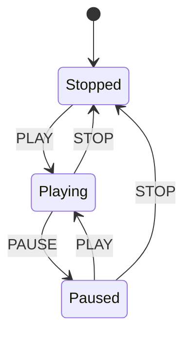

# **Finite-State Machines: Turning Complex Behavior into Explicit Rules**

> A practical, implementation-focused guide to modeling systems that have a finite number of modes and well-defined transitions between them.

---

## **Table of Contents**

1. [Why Finite-State Machines Matter](#1-why-finite-state-machines-matter)
2. [The Core Vocabulary](#2-the-core-vocabulary)
3. [Designing a State Machine](#3-designing-a-state-machine)
4. [A First Implementation in Python](#4-a-first-implementation-in-python)
5. [A Table-Driven Implementation](#5-a-table-driven-implementation)
6. [Guards, Actions, and Context](#6-guards-actions-and-context)
7. [Testing State Machines Thoroughly](#7-testing-state-machines-thoroughly)
8. [Common Design Mistakes](#8-common-design-mistakes)
9. [Hierarchical and Concurrent State Machines](#9-hierarchical-and-concurrent-state-machines)
10. [When to Use—and Avoid—an FSM](#10-when-to-useand-avoidan-fsm)
11. [Practical Exercises](#11-practical-exercises)
12. [Summary and Further Directions](#12-summary-and-further-directions)

---

## **1. Why Finite-State Machines Matter**

A **finite-state machine**, usually abbreviated **FSM**, is a model for a system that:

- can be in exactly one of a finite set of states at a given moment;
- receives events or inputs;
- follows explicit rules that determine whether an event causes a transition;
- may perform work when it enters, exits, or moves between states.

This sounds abstract, but the pattern appears constantly in real software:

- an order is `draft`, `submitted`, `paid`, `shipped`, or `cancelled`;
- a media player is `stopped`, `playing`, or `paused`;
- a network connection is `disconnected`, `connecting`, `connected`, or `failed`;
- a document is `editing`, `reviewing`, `approved`, or `published`;
- a game character is `idle`, `walking`, `jumping`, or `attacking`.

Without an explicit model, state-dependent behavior tends to become a collection of loosely related Boolean flags:

```python
is_connected = True
is_connecting = False
has_failed = True  # Is this combination meaningful?
```

The program now permits a contradictory condition: the connection is both connected and failed. An FSM replaces independent flags with one controlled value:

```python
connection_state = "connected"
```

The important benefit is not merely fewer variables. An FSM makes the **legal behavior of a system visible**. It answers:

1. What situations can exist?
2. What events can occur?
3. Which events are valid in each situation?
4. What happens when a valid event occurs?

That explicitness improves implementation, testing, debugging, documentation, and communication.

---

## **2. The Core Vocabulary**

Every finite-state machine is built from a few concepts.

### **2.1 States**

A **state** represents a meaningful mode of the system. It should summarize the history that matters for deciding what may happen next.

For a turnstile:

- `LOCKED`
- `UNLOCKED`

For an online order:

- `DRAFT`
- `PLACED`
- `PAID`
- `SHIPPED`
- `CANCELLED`

A state should be **behaviorally significant**. If two labels allow exactly the same events and produce the same behavior, they may not need to be separate states.

### **2.2 Events**

An **event** is something that happens to the machine:

- a user clicks a button;
- a timer expires;
- a request succeeds;
- an external service reports a failure;
- a payment is received.

Events are usually named as completed facts or commands:

```text
PAY
CANCEL
SHIP
TIMEOUT
CONNECTION_LOST
```

### **2.3 Transitions**

A **transition** is a permitted movement from one state to another in response to an event.

We can write a transition compactly as:

```text
LOCKED + INSERT_COIN → UNLOCKED
```

The same event may produce different results in different states:

```text
LOCKED   + PUSH → LOCKED
UNLOCKED + PUSH → LOCKED
```

### **2.4 Initial and Terminal States**

The **initial state** is where the machine begins. A **terminal state** has no outgoing transitions and represents completion.

For a background job:

```text
Initial: QUEUED
Terminal: SUCCEEDED, FAILED, CANCELLED
```

Not every machine needs terminal states. A traffic signal, for example, is intended to cycle indefinitely.

### **2.5 Guards**

A **guard** is a condition that must be true before a transition is allowed.

```text
PLACED + PAY [payment_authorized] → PAID
```

If payment authorization fails, the machine remains in `PLACED` or follows a separate failure transition.

### **2.6 Actions**

An **action** is work performed because of a transition:

```text
PAID + SHIP → SHIPPED / send_tracking_email
```

The distinction matters:

- the **state** describes what is true;
- the **event** says what happened;
- the **guard** decides whether a transition is permitted;
- the **action** performs a side effect;
- the **transition** changes the machine's state.

### **2.7 A Transition Table**

A transition table is often the clearest specification:

| Current State | Event | Guard | Next State | Action |
|---|---|---|---|---|
| `DRAFT` | `SUBMIT` | items exist | `PLACED` | reserve inventory |
| `DRAFT` | `CANCEL` | — | `CANCELLED` | discard draft |
| `PLACED` | `PAY` | authorized | `PAID` | record payment |
| `PLACED` | `CANCEL` | not fulfilled | `CANCELLED` | release inventory |
| `PAID` | `SHIP` | address valid | `SHIPPED` | create tracking record |

The table exposes missing cases and ambiguous rules before code is written.

---

## **3. Designing a State Machine**

Writing an FSM should begin with the domain rather than the class structure.

### **Step 1: Define the boundary**

Decide what one machine represents. Is it one user session, one order, one connection, or an entire application?

A machine that owns too much becomes difficult to reason about. A checkout flow and a warehouse fulfillment flow may interact, but they usually deserve separate models.

### **Step 2: Identify meaningful states**

Ask: **Which facts change what events are legal?**

Suppose an article can be edited until publication. A first draft might be:

```text
DRAFT → IN_REVIEW → PUBLISHED
```

If rejected articles return to editing, `REJECTED` may be unnecessary if rejection immediately transitions back to `DRAFT`. However, if rejected articles display differently or record special permissions, it may be a real state.

### **Step 3: List domain events**

Events should describe inputs to the machine, not implementation details:

Good:

```text
SUBMIT_FOR_REVIEW
APPROVE
REJECT
ARCHIVE
```

Less useful:

```text
CALL_DATABASE
SET_STATUS_FIELD
RUN_FUNCTION
```

The latter describe mechanisms, not domain behavior.

### **Step 4: Enumerate legal transitions**

Create a table or diagram. Do not implement only the happy path. Ask what happens if:

- an event is duplicated;
- an event arrives late;
- an event arrives in the wrong state;
- an external action fails;
- two callers race to trigger a transition.

### **Step 5: Choose invalid-event behavior**

There are three common policies:

| Policy | Behavior | Appropriate When |
|---|---|---|
| Reject | Raise or return an error | Invalid input indicates a caller bug |
| Ignore | Leave state unchanged | Duplicate/noisy events are expected |
| Record | Preserve state and log the event | Auditability is important |

Choose deliberately. Silently ignoring every invalid event can hide serious defects.

### **Step 6: Separate transitions from side effects**

State changes are easy to reason about when they are deterministic. Network requests, database writes, and email delivery are not. Keep transition selection pure where possible, then run explicit actions around it.

### **Step 7: State the invariants**

An **invariant** is a condition that must always be true:

```text
If an order is SHIPPED, it must have a tracking number.
If a job is RUNNING, started_at must be populated.
A CANCELLED order can never become SHIPPED.
```

These become high-value tests.

---

## **4. A First Implementation in Python**

Consider a media player with three states:

```text
STOPPED --play--> PLAYING
PLAYING --pause--> PAUSED
PAUSED  --play--> PLAYING
PLAYING --stop--> STOPPED
PAUSED  --stop--> STOPPED
```

Using enums prevents arbitrary strings from becoming states or events:

```python
from enum import Enum, auto


class State(Enum):
    STOPPED = auto()
    PLAYING = auto()
    PAUSED = auto()


class Event(Enum):
    PLAY = auto()
    PAUSE = auto()
    STOP = auto()
```

A direct implementation uses branches:

```python
class InvalidTransition(Exception):
    pass


class MediaPlayer:
    def __init__(self) -> None:
        self.state = State.STOPPED

    def dispatch(self, event: Event) -> None:
        if self.state is State.STOPPED and event is Event.PLAY:
            self.state = State.PLAYING

        elif self.state is State.PLAYING and event is Event.PAUSE:
            self.state = State.PAUSED

        elif self.state is State.PLAYING and event is Event.STOP:
            self.state = State.STOPPED

        elif self.state is State.PAUSED and event is Event.PLAY:
            self.state = State.PLAYING

        elif self.state is State.PAUSED and event is Event.STOP:
            self.state = State.STOPPED

        else:
            raise InvalidTransition(
                f"Cannot handle {event.name} while {self.state.name}"
            )
```

Usage is explicit:

```python
player = MediaPlayer()

player.dispatch(Event.PLAY)
assert player.state is State.PLAYING

player.dispatch(Event.PAUSE)
assert player.state is State.PAUSED

player.dispatch(Event.STOP)
assert player.state is State.STOPPED
```

This version is perfectly reasonable for a small machine. Its strengths are simplicity and easy debugging. Its weakness is that the legal transition graph is spread across conditional branches.

---

## **5. A Table-Driven Implementation**

When the machine grows, represent transitions as data:

```python
from dataclasses import dataclass
from enum import Enum, auto
from typing import Callable


class State(Enum):
    STOPPED = auto()
    PLAYING = auto()
    PAUSED = auto()


class Event(Enum):
    PLAY = auto()
    PAUSE = auto()
    STOP = auto()


Action = Callable[[], None]


@dataclass(frozen=True)
class Transition:
    target: State
    action: Action | None = None
```

Now define the graph in one mapping:

```python
TRANSITIONS: dict[tuple[State, Event], Transition] = {
    (State.STOPPED, Event.PLAY): Transition(State.PLAYING),
    (State.PLAYING, Event.PAUSE): Transition(State.PAUSED),
    (State.PLAYING, Event.STOP): Transition(State.STOPPED),
    (State.PAUSED, Event.PLAY): Transition(State.PLAYING),
    (State.PAUSED, Event.STOP): Transition(State.STOPPED),
}
```

The dispatcher becomes generic:

```python
class InvalidTransition(Exception):
    pass


class StateMachine:
    def __init__(self, initial_state: State) -> None:
        self.state = initial_state

    def dispatch(self, event: Event) -> None:
        key = (self.state, event)

        try:
            transition = TRANSITIONS[key]
        except KeyError:
            raise InvalidTransition(
                f"Cannot handle {event.name} while {self.state.name}"
            ) from None

        if transition.action is not None:
            transition.action()

        self.state = transition.target
```

This design has several advantages:

- the legal graph can be inspected without reading control flow;
- transition data can be validated automatically;
- a generic dispatcher reduces repetitive code;
- adding logging or metrics requires changing one execution path.

However, table-driven code is not automatically better. If every transition requires unique, complicated logic, the table may become a layer of indirection with little value.

### **5.1 Transition ordering**

Should the action run before or after the state changes?

```python
# Option A: action, then state update
transition.action()
self.state = transition.target

# Option B: state update, then action
self.state = transition.target
transition.action()
```

There is no universal answer. The important question is what should happen if the action fails.

- **Action first:** the state remains unchanged on failure, but the action might have partially completed.
- **State first:** the machine reflects the intended transition, but the action may not have occurred.
- **Atomic transaction:** state and durable action record commit together, often the best choice for business workflows.

For reliable distributed systems, store the new state and an **outbox message** in one database transaction. A separate worker later delivers the side effect. This prevents an order from becoming `PAID` without eventually producing its receipt event.

---

## **6. Guards, Actions, and Context**

Real machines need data beyond the state label. That data is often called the machine's **context**.

Consider a download job:

```python
from dataclasses import dataclass
from enum import Enum, auto


class DownloadState(Enum):
    QUEUED = auto()
    DOWNLOADING = auto()
    PAUSED = auto()
    COMPLETE = auto()
    FAILED = auto()


class DownloadEvent(Enum):
    START = auto()
    PAUSE = auto()
    RESUME = auto()
    PROGRESS = auto()
    FINISH = auto()
    ERROR = auto()


@dataclass
class DownloadContext:
    url: str
    bytes_received: int = 0
    total_bytes: int | None = None
    error_message: str | None = None
```

The current state and context serve different roles:

```python
@dataclass
class Download:
    state: DownloadState
    context: DownloadContext
```

### **6.1 Guard functions**

A guard should ideally be a pure function:

```python
def can_finish(download: Download) -> bool:
    total = download.context.total_bytes
    return total is not None and download.context.bytes_received >= total
```

Pure guards are predictable because they do not mutate the machine or call unreliable services.

### **6.2 Event payloads**

Events often carry data. Model the event type and payload together:

```python
from dataclasses import dataclass


@dataclass(frozen=True)
class Progress:
    bytes_received: int


@dataclass(frozen=True)
class Failure:
    message: str
```

A dispatcher can use pattern matching:

```python
def dispatch(download: Download, event: object) -> None:
    match download.state, event:
        case DownloadState.QUEUED, DownloadEvent.START:
            download.state = DownloadState.DOWNLOADING

        case DownloadState.DOWNLOADING, Progress(bytes_received=count):
            if count < download.context.bytes_received:
                raise ValueError("Progress cannot move backward")
            download.context.bytes_received = count

        case DownloadState.DOWNLOADING, DownloadEvent.PAUSE:
            download.state = DownloadState.PAUSED

        case DownloadState.PAUSED, DownloadEvent.RESUME:
            download.state = DownloadState.DOWNLOADING

        case DownloadState.DOWNLOADING, DownloadEvent.FINISH:
            if not can_finish(download):
                raise ValueError("Download is not complete")
            download.state = DownloadState.COMPLETE

        case (
            DownloadState.DOWNLOADING | DownloadState.PAUSED,
            Failure(message=message),
        ):
            download.context.error_message = message
            download.state = DownloadState.FAILED

        case _:
            raise InvalidTransition(
                f"Invalid event {event!r} in {download.state.name}"
            )
```

This approach keeps rules close to the data they affect while making invalid combinations explicit.

### **6.3 Entry and exit actions**

Some actions conceptually belong to states rather than transitions:

- entering `RUNNING` starts a timer;
- exiting `RUNNING` stops it;
- entering `FAILED` emits an alert;
- entering `COMPLETE` releases temporary files.

Be careful with entry actions if multiple transitions enter the same state for different reasons. An explicit transition action is usually easier to understand when behavior depends on the event.

---

## **7. Testing State Machines Thoroughly**

FSMs are unusually testable because their rules are finite and explicit.

### **7.1 Test every legal transition**

With `pytest`, table-driven tests mirror the machine:

```python
import pytest


@pytest.mark.parametrize(
    ("start", "event", "expected"),
    [
        (State.STOPPED, Event.PLAY, State.PLAYING),
        (State.PLAYING, Event.PAUSE, State.PAUSED),
        (State.PLAYING, Event.STOP, State.STOPPED),
        (State.PAUSED, Event.PLAY, State.PLAYING),
        (State.PAUSED, Event.STOP, State.STOPPED),
    ],
)
def test_legal_transitions(start, event, expected):
    machine = StateMachine(start)
    machine.dispatch(event)
    assert machine.state is expected
```

### **7.2 Test every illegal combination**

For small machines, generate all state/event pairs:

```python
@pytest.mark.parametrize(
    ("state", "event"),
    [
        (state, event)
        for state in State
        for event in Event
        if (state, event) not in TRANSITIONS
    ],
)
def test_illegal_transitions_are_rejected(state, event):
    machine = StateMachine(state)

    with pytest.raises(InvalidTransition):
        machine.dispatch(event)

    assert machine.state is state
```

This test also verifies that rejected events do not accidentally mutate state.

### **7.3 Test paths, not only edges**

An individual transition may work while a realistic sequence fails:

```python
def test_pause_resume_stop_path():
    machine = StateMachine(State.STOPPED)

    for event in (
        Event.PLAY,
        Event.PAUSE,
        Event.PLAY,
        Event.STOP,
    ):
        machine.dispatch(event)

    assert machine.state is State.STOPPED
```

### **7.4 Property-based testing**

Property-based tools such as Hypothesis generate event sequences and check invariants:

```python
from hypothesis import given
from hypothesis import strategies as st


@given(st.lists(st.sampled_from(list(Event)), max_size=100))
def test_machine_never_has_an_unknown_state(events):
    machine = StateMachine(State.STOPPED)

    for event in events:
        try:
            machine.dispatch(event)
        except InvalidTransition:
            pass

        assert machine.state in State
```

A stronger property would assert domain-specific invariants after every event.

### **7.5 Validate the graph**

The transition table itself can be checked:

```python
def reachable_states(initial: State) -> set[State]:
    seen = {initial}
    changed = True

    while changed:
        changed = False
        for (source, _event), transition in TRANSITIONS.items():
            if source in seen and transition.target not in seen:
                seen.add(transition.target)
                changed = True

    return seen


def test_all_states_are_reachable():
    assert reachable_states(State.STOPPED) == set(State)
```

Other useful graph checks include:

- terminal states have no outgoing transitions;
- every nonterminal state has at least one outgoing transition;
- required events are handled in specified states;
- no transition points to an undefined state;
- forbidden states are unreachable from production initial states.

---

## **8. Common Design Mistakes**

### **8.1 Boolean flag explosions**

Three independent flags create eight possible combinations:

```python
is_open: bool
is_locked: bool
is_broken: bool
```

If only four combinations are valid, half the representable state space is nonsense. Prefer an enum or split genuinely independent concerns into separate machines.

### **8.2 Encoding data as states**

Avoid states such as:

```text
DOWNLOADED_10_PERCENT
DOWNLOADED_20_PERCENT
DOWNLOADED_30_PERCENT
```

Progress is data, not a behavioral mode. Use:

```python
state = DownloadState.DOWNLOADING
progress_percent = 30
```

Create a separate state only if the system's legal behavior changes.

### **8.3 Too many states**

A state for every minor variation creates a graph that is impossible to inspect. Separate:

- **control state:** determines allowed behavior;
- **context data:** records values;
- **orthogonal state:** independent lifecycle handled by another machine.

### **8.4 Hidden transitions**

This is dangerous:

```python
order.status = "shipped"
```

Any caller can bypass guards, invariants, actions, and audit logging. Encapsulate mutation:

```python
order.dispatch(Ship(tracking_number="ZX-1042"))
```

### **8.5 Side effects inside guards**

A guard named `can_ship()` should not reserve inventory or send mail. Guards may run more than once and should be safe to evaluate.

### **8.6 Confusing failed actions with failed transitions**

Suppose charging a card fails. That is a domain outcome, not necessarily an exception in the state-machine engine. Model it explicitly:

```text
PAYMENT_PENDING + PAYMENT_SUCCEEDED → PAID
PAYMENT_PENDING + PAYMENT_FAILED    → PAYMENT_DECLINED
```

Exceptions should generally represent programming failures or unavailable infrastructure, while expected business outcomes should be events and states.

### **8.7 Ignoring concurrency**

Two workers can read `PAID` and both attempt `SHIP`. An in-memory FSM does not solve database concurrency.

Use optimistic locking:

```sql
UPDATE orders
SET state = 'SHIPPED', version = version + 1
WHERE id = :id
  AND state = 'PAID'
  AND version = :expected_version;
```

If zero rows are updated, another process changed the order first. Reload and decide whether to reject or treat the event as idempotent.

### **8.8 Treating diagrams as executable truth**

A diagram is useful documentation, but it can drift from code. Prefer generating diagrams from the transition table or testing that the documented transitions match the implementation.

---

## **9. Hierarchical and Concurrent State Machines**

Flat FSMs eventually struggle with repeated or independent behavior.

### **9.1 Hierarchical states**

Suppose a connection has these states:

```text
DISCONNECTED
CONNECTING
CONNECTED_IDLE
CONNECTED_BUSY
```

Both connected substates may handle `CONNECTION_LOST` identically. A hierarchical machine introduces a parent:

```text
CONNECTED
├── IDLE
└── BUSY
```

The parent owns shared transitions:

```text
CONNECTED + CONNECTION_LOST → DISCONNECTED
```

Hierarchical state machines reduce repetition and clarify shared behavior. They also increase engine complexity, so use them only when a flat graph has real duplication.

### **9.2 Concurrent regions**

A music application might independently track:

- playback: `STOPPED`, `PLAYING`, `PAUSED`;
- network: `OFFLINE`, `ONLINE`;
- synchronization: `CLEAN`, `SYNCING`, `DIRTY`.

Combining them into one flat state produces a Cartesian explosion:

```text
PLAYING_ONLINE_SYNCING
PLAYING_OFFLINE_DIRTY
PAUSED_ONLINE_CLEAN
...
```

Instead, use three cooperating machines:

```python
@dataclass
class AppState:
    playback: PlaybackState
    network: NetworkState
    sync: SyncState
```

Keep independent dimensions independent, then define coordination rules where they genuinely interact.

---

## **10. When to Use—and Avoid—an FSM**

### **Use an FSM when**

- behavior depends strongly on the current mode;
- only certain event sequences are valid;
- lifecycle rules must be auditable;
- invalid transitions should be rejected consistently;
- a workflow has a manageable number of discrete phases;
- test coverage of all legal transitions is valuable.

### **Avoid or reconsider an FSM when**

- the problem is primarily numerical computation;
- every value is effectively a distinct state;
- transitions are unconstrained and state does not affect behavior;
- the workflow is mostly a dynamic graph defined by users;
- independent concerns are being forced into one enormous machine.

For user-configurable business processes, a workflow engine may be more appropriate. For continuous control systems, differential equations or feedback controllers may fit better. For parsing nested languages, a pushdown automaton or parser is more capable than a basic FSM.

### **FSM versus the State design pattern**

These ideas are related but not identical.

| Finite-State Machine | State Design Pattern |
|---|---|
| A behavioral model | An object-oriented implementation technique |
| Emphasizes states, events, and transitions | Emphasizes polymorphic state objects |
| Often table-driven | Often class-driven |
| Easy to analyze as a graph | Useful when each state has substantial behavior |

A State-pattern implementation might look like:

```python
from typing import Protocol


class PlayerState(Protocol):
    def play(self, player: "Player") -> None: ...
    def pause(self, player: "Player") -> None: ...
    def stop(self, player: "Player") -> None: ...


class Stopped:
    def play(self, player: "Player") -> None:
        player.state = Playing()

    def pause(self, player: "Player") -> None:
        raise InvalidTransition("Cannot pause a stopped player")

    def stop(self, player: "Player") -> None:
        pass  # Idempotent operation
```

This can be effective when state-specific behavior is large. For simple transition graphs, enums and tables are usually easier to inspect.

---

## **11. Practical Exercises**

### **Exercise 1: A traffic light**

Implement:

```text
RED → GREEN → YELLOW → RED
```

Requirements:

- accept only a `TIMER_EXPIRED` event;
- reject attempts to skip a state;
- test that three events return the machine to its starting state.

### **Exercise 2: An issue tracker**

Model:

```text
OPEN → IN_PROGRESS → RESOLVED → CLOSED
```

Add rules:

- a resolved issue may be reopened;
- a closed issue is terminal;
- only an assigned issue may move to `IN_PROGRESS`;
- entering `RESOLVED` requires a resolution note.

Decide whether assignment belongs in the control state or in context data, and justify the choice.

### **Exercise 3: A retrying job**

Create states:

```text
QUEUED
RUNNING
WAITING_TO_RETRY
SUCCEEDED
FAILED
```

The context should store:

```python
attempt_count: int
max_attempts: int
last_error: str | None
```

Model both temporary and permanent failure. Ensure a job becomes `FAILED` when it exhausts its retry allowance.

### **Exercise 4: Graph analysis**

Write functions that:

1. find unreachable states;
2. find states with no outgoing transitions;
3. list all events legal in a given state;
4. export a transition table as Mermaid syntax.

Example output:



### **Exercise 5: Persistence and concurrency**

Persist an order FSM in a relational database. Add a `version` column and implement optimistic locking. Then test two simulated workers trying to perform the same transition.

The key invariant is:

> At most one worker may successfully commit a transition from a particular version.

---

## **12. Summary and Further Directions**

A finite-state machine converts implicit lifecycle assumptions into a controlled model:

```text
current state + event + guard → next state + action
```

The strongest practical habits are:

1. **Model behavior before writing classes.**
2. **Use states only for behaviorally distinct modes.**
3. **Represent legal transitions explicitly.**
4. **Keep context data separate from control state.**
5. **Treat guards as pure predicates whenever possible.**
6. **Make side effects and failure semantics deliberate.**
7. **Test every edge, important path, and domain invariant.**
8. **Address persistence and concurrency outside the in-memory model.**
9. **Split independent state dimensions into cooperating machines.**

Once these principles are internalized, FSMs become more than diagrams. They become a compact way to encode rules, prevent impossible situations, and make complex behavior understandable to both humans and software.

### **Where to go next**

Explore these related topics:

- **Mealy and Moore machines:** whether outputs belong to transitions or states;
- **statecharts:** hierarchy, concurrency, history, and richer event semantics;
- **event sourcing:** rebuilding state from an ordered event stream;
- **workflow orchestration:** durable execution across services;
- **model-based testing:** generating tests directly from a transition model;
- **formal verification:** proving safety and liveness properties of stateful systems.

---

> **Final design test:** If a new engineer can inspect your state list and transition table and accurately explain what the system permits, the model is doing useful work.
